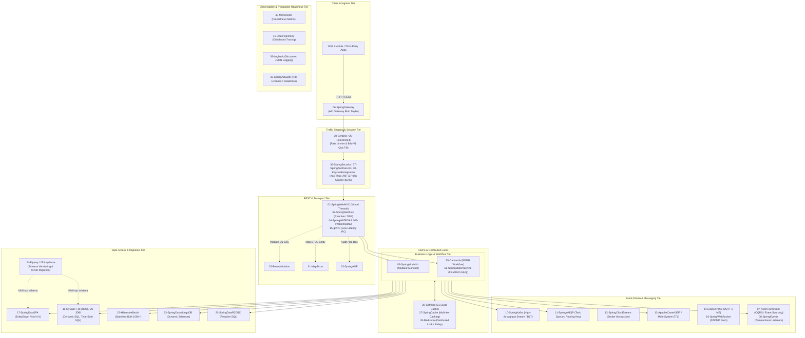

# Java Enterprise Modern Architecture Playbook

<p align="center">
  
  
  
  
  
  
</p>

---

## 📖 Tổng Quan Dự Án (Overview & Philosophy)

Kho lưu trữ này là **Bộ tài liệu kiến trúc thực chiến và mã nguồn mẫu toàn diện gồm 61 dự án độc lập (Standalone Projects)** trong hệ sinh thái **Java 21 & Spring Boot 3.4.1**.

### 🎯 Triết lý cốt lõi (Core Principles)
1. **Giải quyết triệt để vấn đề thực tế (Zero-Fluff)**: Không dạy cú pháp "Hello World" học vẹt. Mỗi project tập trung trực diện vào **bài toán sản xuất (Pain Point)** và **ứng dụng thực tiễn (Enterprise Production Use Case)**.
2. **Chuẩn hóa kỹ thuật cấp Enterprise**:
   - **Java 21 LTS**: 100% hỗ trợ **Virtual Threads** (`spring.threads.virtual.enabled: true`), Pattern Matching, Sealed Interfaces.
   - **Java Records**: Dùng Record nguyên bản làm DTO và Domain Event, đảm bảo tính bất biến (Immutability) và tối ưu hóa bộ nhớ Heap.
   - **Nói KHÔNG với Lombok**: Loại bỏ hoàn toàn annotation processing can thiệp bytecode ngầm, giúp code minh bạch, tăng tốc độ compile và tương thích hoàn hảo với GraalVM Native Image.
   - **Độc lập hoàn toàn**: Mỗi dự án là một Maven module độc lập, có thể copy và chạy ngay lập tức mà không phụ thuộc module cha.
   - **Cổng dịch vụ phân lập**: 61 dự án được gán dải cổng riêng biệt từ `8101` đến `8161`, không trùng lặp.
   - **100% Sẵn sàng kiểm thử**: Mọi dự án đều có **REST Controller**, **Unit/Integration Test (TDD)** và file kịch bản gọi API **`requests.http`** chuẩn hóa.

---

## 🗺️ Bản Đồ Kiến Trúc Hệ Thống (System Blueprint)

Một kiến trúc doanh nghiệp hiện đại (Microservices / Distributed System) được phân lớp và phối hợp các thư viện chặt chẽ:



---

## 📋 Danh Mục Toàn Diện 61 Thư Viện Thực Chiến

### I. Web API & Giao Tiếp Client-Server (01 – 06)

| Dự án | Port | Thư viện / Công nghệ | Vấn đề giải quyết trong thực tế (Pain Point) | Chi tiết |
|---|:---:|---|---|:---:|
| [**01-SpringWebMVC**](./01-SpringWebMVC/) | `8101` | Spring Web MVC + Virtual Threads | Chuẩn hóa API CRUD đồng bộ; bật Java 21 Virtual Threads phục vụ hàng chục ngàn request đồng thời không nghẽn Thread Pool. | [README](./01-SpringWebMVC/README.md) \| [HTTP](./01-SpringWebMVC/requests.http) |
| [**02-SpringWebFlux**](./02-SpringWebFlux/) | `8102` | Spring WebFlux & Reactive Netty | Giữ hàng trăm ngàn kết nối mở liên tục (Server-Sent Events, Streaming) với tài nguyên RAM và Thread tối thiểu. | [README](./02-SpringWebFlux/README.md) \| [HTTP](./02-SpringWebFlux/requests.http) |
| [**03-SpringModulith**](./03-SpringModulith/) | `8103` | Spring Modulith | Ngăn chặn Monolith biến thành "Big Ball of Mud", kiểm soát ranh giới Domain Boundaries bằng test tự động. | [README](./03-SpringModulith/README.md) \| [HTTP](./03-SpringModulith/requests.http) |
| [**04-SpringHATEOAS**](./04-SpringHATEOAS/) | `8104` | Spring HATEOAS | Client không phải hardcode URL; trả về liên kết hành động khả dĩ (`links`) theo trạng thái động của đối tượng. | [README](./04-SpringHATEOAS/README.md) \| [HTTP](./04-SpringHATEOAS/requests.http) |
| [**05-ProblemDetail**](./05-ProblemDetail/) | `8105` | RFC 9457 Problem Detail | Xóa bỏ tình trạng mỗi lập trình viên tự chế một kiểu trả lỗi JSON; chuẩn hóa format lỗi quốc tế nhất quán cho Frontend/Mobile. | [README](./05-ProblemDetail/README.md) \| [HTTP](./05-ProblemDetail/requests.http) |
| [**06-SpringGateway**](./06-SpringGateway/) | `8106` | Spring Cloud Gateway | Cửa ngõ duy nhất tiếp nhận request: định tuyến URL, lọc token JWT, rate limit, bảo vệ an toàn cho các microservice bên trong. | [README](./06-SpringGateway/README.md) \| [HTTP](./06-SpringGateway/requests.http) |

---

### II. Xử Lý Bất Đồng Bộ, Sự Kiện & Tích Hợp Hệ Thống (07 – 16)

| Dự án | Port | Thư viện / Công nghệ | Vấn đề giải quyết trong thực tế (Pain Point) | Chi tiết |
|---|:---:|---|---|:---:|
| [**07-AxonFramework**](./07-AxonFramework/) | `8107` | Axon Framework (CQRS / Event Sourcing) | Giao dịch tài chính, ví điện tử không bao giờ được ghi đè số dư; lưu trữ chuỗi sự kiện bất biến và điều phối Saga phân tán. | [README](./07-AxonFramework/README.md) \| [HTTP](./07-AxonFramework/requests.http) |
| [**08-SpringEvents**](./08-SpringEvents/) | `8108` | Spring ApplicationEvent | Tách rời nghiệp vụ nội bộ bằng Event; dùng `@TransactionalEventListener(phase = AFTER_COMMIT)` đảm bảo chỉ gửi mail khi DB đã commit. | [README](./08-SpringEvents/README.md) \| [HTTP](./08-SpringEvents/requests.http) |
| [**09-SpringIntegration**](./09-SpringIntegration/) | `8109` | Spring Integration (EIP) | Tích hợp hệ thống cũ qua giao thức cổ điển: quét file SFTP, đọc mail POP3/IMAP, socket TCP thô theo mẫu Enterprise Integration Patterns. | [README](./09-SpringIntegration/README.md) \| [HTTP](./09-SpringIntegration/requests.http) |
| [**10-SpringKafka**](./10-SpringKafka/) | `8110` | Apache Kafka + Spring Kafka | Xử lý traffic hàng trăm ngàn message/giây không mất mát dữ liệu; tích hợp cơ chế Dead Letter Topic (DLT) xử lý tin lỗi. | [README](./10-SpringKafka/README.md) \| [HTTP](./10-SpringKafka/requests.http) |
| [**11-SpringAMQP**](./11-SpringAMQP/) | `8111` | RabbitMQ + Spring AMQP | Định tuyến tin nhắn linh hoạt bằng routing key, hàng đợi ưu tiên, cơ chế xác nhận xử lý (ACK/NACK) cho tác vụ ngầm. | [README](./11-SpringAMQP/README.md) \| [HTTP](./11-SpringAMQP/requests.http) |
| [**12-SpringCloudStream**](./12-SpringCloudStream/) | `8112` | Spring Cloud Stream | Viết logic xử lý luồng dạng `Function<In, Out>` thuần túy, có thể đổi broker từ RabbitMQ sang Kafka qua file cấu hình. | [README](./12-SpringCloudStream/README.md) \| [HTTP](./12-SpringCloudStream/requests.http) |
| [**13-ApacheCamel**](./13-ApacheCamel/) | `8113` | Apache Camel | Tích hợp đa hệ thống phức tạp: đọc XML -> parse JSON -> chia nhỏ (Splitter) -> gọi 3 API làm giàu dữ liệu -> tổng hợp ghi DB. | [README](./13-ApacheCamel/README.md) \| [HTTP](./13-ApacheCamel/requests.http) |
| [**14-EclipsePaho**](./14-EclipsePaho/) | `8114` | Eclipse Paho MQTT 5 | Kết nối thiết bị nhúng IoT, cảm biến công nghiệp trong điều kiện sóng chập chờn, băng thông siêu yếu qua chuẩn MQTT 5. | [README](./14-EclipsePaho/README.md) \| [HTTP](./14-EclipsePaho/requests.http) |
| [**15-gRPC**](./15-gRPC/) | `8115` | gRPC Java & HTTP/2 | Giao tiếp microservice-to-microservice với độ trễ siêu thấp bằng Protobuf nhị phân, thay thế REST JSON cồng kềnh. | [README](./15-gRPC/README.md) \| [HTTP](./15-gRPC/requests.http) |
| [**16-SpringWebSocket**](./16-SpringWebSocket/) | `8116` | Spring WebSocket + STOMP | Đẩy dữ liệu thời gian thực xuống trình duyệt (Chat, thông báo chuông, bản đồ tài xế) mà không cần polling liên tục. | [README](./16-SpringWebSocket/README.md) \| [HTTP](./16-SpringWebSocket/requests.http) |

---

### III. Tương Tác Cơ Sở Dữ Liệu & Schema Migration (17 – 25)

| Dự án | Port | Thư viện / Công nghệ | Vấn đề giải quyết trong thực tế (Pain Point) | Chi tiết |
|---|:---:|---|---|:---:|
| [**17-SpringDataJPA**](./17-SpringDataJPA/) | `8117` | Spring Data JPA / Hibernate | Triệt tiêu lỗi kinh điển **N+1 Query** bằng `@EntityGraph`, tự động quản lý ngày tạo/người tạo với JPA Auditing. | [README](./17-SpringDataJPA/README.md) \| [HTTP](./17-SpringDataJPA/requests.http) |
| [**18-MyBatis**](./18-MyBatis/) | `8118` | MyBatis 3 Dynamic SQL | DBA yêu cầu kiểm soát chặt từng dòng SQL; hỗ trợ Dynamic SQL mạnh mẽ bằng thẻ XML (`<if>`, `<foreach>`), TypeHandler enum. | [README](./18-MyBatis/README.md) \| [HTTP](./18-MyBatis/requests.http) |
| [**19-jOOQ**](./19-jOOQ/) | `8119` | jOOQ Type-Safe SQL | Viết SQL phức tạp (Window Functions, CTE, JSON) trực tiếp bằng Java Type-Safe; phát hiện lỗi cú pháp và sai tên cột ngay lúc Compile. | [README](./19-jOOQ/README.md) \| [HTTP](./19-jOOQ/requests.http) |
| [**20-JDBI**](./20-JDBI/) | `8120` | JDBI 3 Fluent SQL | Cần thao tác SQL nhanh gọn cho batch job/microservice nhỏ mà không bị cồng kềnh như JPA và không thô ráp như JDBC. | [README](./20-JDBI/README.md) \| [HTTP](./20-JDBI/requests.http) |
| [**21-SpringDataR2DBC**](./21-SpringDataR2DBC/) | `8121` | Spring Data R2DBC | Truy cập CSDL quan hệ (PostgreSQL, MySQL) theo mô hình Non-blocking I/O, không bị chặn luồng trong kiến trúc Reactive. | [README](./21-SpringDataR2DBC/README.md) \| [HTTP](./21-SpringDataR2DBC/requests.http) |
| [**22-HibernateBatch**](./22-HibernateBatch/) | `8122` | Hibernate Batch & Bulk Operations | Chèn 100.000 bản ghi không bị tràn bộ nhớ (OOM) bằng `StatelessSession` và cấu hình `batch_size`, bỏ qua first-level cache. | [README](./22-HibernateBatch/README.md) \| [HTTP](./22-HibernateBatch/requests.http) |
| [**23-SpringDataMongoDB**](./23-SpringDataMongoDB/) | `8123` | Spring Data MongoDB | Quản lý dữ liệu bán hàng có cấu trúc động thay đổi liên tục, Document JSON phức tạp và chỉ mục địa lý Geospatial. | [README](./23-SpringDataMongoDB/README.md) \| [HTTP](./23-SpringDataMongoDB/requests.http) |
| [**24-Flyway**](./24-Flyway/) | `8124` | Flyway Database Migration | Tự động nâng cấp phiên bản CSDL qua script SQL (`V1__...`, `V2__...`), loại bỏ lỗi quên chạy script DB khi deploy Production. | [README](./24-Flyway/README.md) \| [HTTP](./24-Flyway/requests.http) |
| [**25-Liquibase**](./25-Liquibase/) | `8125` | Liquibase Migration | Định nghĩa thay đổi schema độc lập với hệ quản trị CSDL (chạy trên cả Oracle, Postgres, SQL Server) kèm hỗ trợ Rollback an toàn. | [README](./25-Liquibase/README.md) \| [HTTP](./25-Liquibase/requests.http) |

---

### IV. Caching & Khả Năng Chống Chịu Lỗi Hệ Thống (26 – 30)

| Dự án | Port | Thư viện / Công nghệ | Vấn đề giải quyết trong thực tế (Pain Point) | Chi tiết |
|---|:---:|---|---|:---:|
| [**26-Caffeine**](./26-Caffeine/) | `8126` | Caffeine In-Memory Cache | Local Cache nhanh nhất thế giới trên JVM (thuật toán W-TinyLFU); truy xuất dữ liệu nano-giây, giảm 80-90% truy vấn DB. | [README](./26-Caffeine/README.md) \| [HTTP](./26-Caffeine/requests.http) |
| [**27-SpringCache**](./27-SpringCache/) | `8127` | Spring Cache Abstraction | Tách biệt logic caching khỏi code nghiệp vụ qua annotation `@Cacheable`, `@CacheEvict`; linh hoạt chuyển đổi giữa Caffeine và Redis. | [README](./27-SpringCache/README.md) \| [HTTP](./27-SpringCache/requests.http) |
| [**28-Redisson**](./28-Redisson/) | `8128` | Redisson Distributed Data | Ngăn chặn overselling (bán vượt số lượng) trên cụm nhiều server bằng **Khóa phân tán (Distributed Lock)**, RMap, RRateLimiter. | [README](./28-Redisson/README.md) \| [HTTP](./28-Redisson/requests.http) |
| [**29-Resilience4j**](./29-Resilience4j/) | `8129` | Resilience4j Fault Tolerance | Chống sập hệ thống theo dây chuyền (Cascading Failure) khi đối tác lỗi bằng Circuit Breaker, Retry, Rate Limiter và Bulkhead. | [README](./29-Resilience4j/README.md) \| [HTTP](./29-Resilience4j/requests.http) |
| [**30-Sentinel**](./30-Sentinel/) | `8130` | Alibaba Sentinel | Điều tiết luồng lưu lượng (Traffic Shaping), xếp hàng request trong đợt Flash Sale, tự động giảm tải theo mức độ chiếm dụng CPU. | [README](./30-Sentinel/README.md) \| [HTTP](./30-Sentinel/requests.http) |

---

### V. Mapping, Validation, AOP & HTTP Clients (31 – 35)

| Dự án | Port | Thư viện / Công nghệ | Vấn đề giải quyết trong thực tế (Pain Point) | Chi tiết |
|---|:---:|---|---|:---:|
| [**31-MapStruct**](./31-MapStruct/) | `31-MapStruct` -> `8131` | MapStruct Compile-Time Mapper | Loại bỏ code getter/setter thủ công hàng ngàn dòng; sinh code mapping thuần lúc compile, tốc độ vượt trội so với Reflection. | [README](./31-MapStruct/README.md) \| [HTTP](./31-MapStruct/requests.http) |
| [**32-BeanValidation**](./32-BeanValidation/) | `8132` | Jakarta Bean Validation | Chặn đứng dữ liệu bẩn ngay tại Controller bằng annotation `@NotNull`, `@Size`, validator tự chế số điện thoại, mật khẩu mạnh. | [README](./32-BeanValidation/README.md) \| [HTTP](./32-BeanValidation/requests.http) |
| [**33-SpringAOP**](./33-SpringAOP/) | `8133` | Spring AOP | Ghi audit log (ai làm gì, lúc mấy giờ) và đo thời gian thực thi của các phương thức một cách trong suốt bằng Custom Annotation. | [README](./33-SpringAOP/README.md) \| [HTTP](./33-SpringAOP/requests.http) |
| [**34-SpringCloudOpenFeign**](./34-SpringCloudOpenFeign/) | `8134` | Spring Cloud OpenFeign | Khai báo gọi REST API giữa các service dưới dạng Java Interface tiện lợi, tự động tích hợp Fallback và Retry. | [README](./34-SpringCloudOpenFeign/README.md) \| [HTTP](./34-SpringCloudOpenFeign/requests.http) |
| [**35-SpringRestClient**](./35-SpringRestClient/) | `8135` | Spring 6.1 RestClient & HttpExchange | HTTP Client đồng bộ hiện đại nhất thay thế RestTemplate cũ; cú pháp Fluent API trực quan, hỗ trợ khai báo Interface HTTP. | [README](./35-SpringRestClient/README.md) \| [HTTP](./35-SpringRestClient/requests.http) |

---

### VI. Bảo Mật Doanh Nghiệp & Định Danh Phân Tán (36 – 38)

| Dự án | Port | Thư viện / Công nghệ | Vấn đề giải quyết trong thực tế (Pain Point) | Chi tiết |
|---|:---:|---|---|:---:|
| [**36-SpringSecurity**](./36-SpringSecurity/) | `8136` | Spring Security 6 & Stateless JWT | Bảo vệ API với JWT Bearer Token, mã hóa mật khẩu BCrypt, phân quyền chi tiết tới từng hàm bằng `@PreAuthorize`. | [README](./36-SpringSecurity/README.md) \| [HTTP](./36-SpringSecurity/requests.http) |
| [**37-SpringAuthServer**](./37-SpringAuthServer/) | `8137` | Spring Authorization Server | Xây dựng Identity Provider độc lập theo chuẩn OAuth2 / OpenID Connect; phát hành JWT ký số bằng cặp khóa RSA (JWKS). | [README](./37-SpringAuthServer/README.md) \| [HTTP](./37-SpringAuthServer/requests.http) |
| [**38-KeycloakIntegration**](./38-KeycloakIntegration/) | `8138` | Keycloak SSO Resource Server | Kết nối hệ thống với máy chủ đăng nhập tập trung Keycloak; tự động giải mã JWT và map vai trò người dùng vào Spring Context. | [README](./38-KeycloakIntegration/README.md) \| [HTTP](./38-KeycloakIntegration/requests.http) |

---

### VII. Nhật Ký Có Cấu Trúc & Giám Sát Đo Đạc (39 – 42)

| Dự án | Port | Thư viện / Công nghệ | Vấn đề giải quyết trong thực tế (Pain Point) | Chi tiết |
|---|:---:|---|---|:---:|
| [**39-Logback**](./39-Logback/) | `8139` | Logback + Logstash JSON Encoder | Xuất log JSON có cấu trúc đẩy trực tiếp vào ELK/Loki; gắn `traceId` và `userId` xuyên suốt vòng đời request qua MDC. | [README](./39-Logback/README.md) \| [HTTP](./39-Logback/requests.http) |
| [**40-Micrometer**](./40-Micrometer/) | `8140` | Micrometer & Prometheus | Cung cấp số liệu đo đạc QPS, thời gian phản hồi p95/p99, tỉ lệ lỗi phục vụ vẽ biểu đồ giám sát trên Dashboard Grafana. | [README](./40-Micrometer/README.md) \| [HTTP](./40-Micrometer/requests.http) |
| [**41-OpenTelemetry**](./41-OpenTelemetry/) | `8141` | OpenTelemetry Tracing | Truy vết phân tán (Distributed Tracing) xuyên qua nhiều microservice; phát hiện chính xác vị trí gây chậm trên Jaeger/Zipkin. | [README](./41-OpenTelemetry/README.md) \| [HTTP](./41-OpenTelemetry/requests.http) |
| [**42-SpringActuator**](./42-SpringActuator/) | `8142` | Spring Boot Actuator | Cung cấp Probe Liveness / Readiness cho cụm Kubernetes; tự viết `CustomHealthIndicator` kiểm tra tình trạng DB trước khi nhận khách. | [README](./42-SpringActuator/README.md) \| [HTTP](./42-SpringActuator/requests.http) |

---

### VIII. Tác Vụ Ngầm & Lập Lịch Phân Tán (43 – 45)

| Dự án | Port | Thư viện / Công nghệ | Vấn đề giải quyết trong thực tế (Pain Point) | Chi tiết |
|---|:---:|---|---|:---:|
| [**43-Quartz**](./43-Quartz/) | `8143` | Quartz Scheduler Enterprise | Lập lịch phức tạp (ngày cuối cùng của tháng, xử lý bù misfire); lưu trữ trạng thái lịch chạy vào CSDL quan hệ. | [README](./43-Quartz/README.md) \| [HTTP](./43-Quartz/requests.http) |
| [**44-JobRunr**](./44-JobRunr/) | `8144` | JobRunr Background Worker | Chạy background job siêu nhẹ bằng Lambda expression; có sẵn giao diện Web Dashboard trực quan theo dõi và bấm Retry khi lỗi. | [README](./44-JobRunr/README.md) \| [HTTP](./44-JobRunr/requests.http) |
| [**45-ShedLock**](./45-ShedLock/) | `8145` | ShedLock Distributed Scheduler | Ngăn chặn hiện tượng 5 Pod Kubernetes chạy cùng 1 cronjob dẫn tới gửi 5 email trùng nhau cho cùng một khách hàng. | [README](./45-ShedLock/README.md) \| [HTTP](./45-ShedLock/requests.http) |

---

### IX. Kiểm Thử Phần Mềm Chuẩn Mực & Đo Hiệu Năng (46 – 52)

| Dự án | Port | Thư viện / Công nghệ | Vấn đề giải quyết trong thực tế (Pain Point) | Chi tiết |
|---|:---:|---|---|:---:|
| [**46-JUnit5-Mockito**](./46-JUnit5-Mockito/) | `8146` | JUnit 5 & Mockito | Viết Unit Test cô lập bằng Mock giả lập; sử dụng `ArgumentCaptor` và test tham số hóa `@ParameterizedTest`. | [README](./46-JUnit5-Mockito/README.md) \| [HTTP](./46-JUnit5-Mockito/requests.http) |
| [**47-AssertJ**](./47-AssertJ/) | `8147` | AssertJ Fluent Assertions | Viết câu lệnh assertion dễ đọc; hỗ trợ so sánh sâu toàn bộ cấu trúc object đệ quy (`usingRecursiveComparison`) và gom lỗi. | [README](./47-AssertJ/README.md) \| [HTTP](./47-AssertJ/requests.http) |
| [**48-Testcontainers**](./48-Testcontainers/) | `8148` | Testcontainers Real Docker | Tự động dựng Docker Container thật (Postgres, Redis) trong lúc chạy test, đảm bảo môi trường test giống 100% môi trường thật. | [README](./48-Testcontainers/README.md) \| [HTTP](./48-Testcontainers/requests.http) |
| [**49-Datafaker**](./49-Datafaker/) | `8149` | Datafaker Mock Data | Tự động sinh hàng vạn bản ghi dữ liệu giả lập có ý nghĩa thực tế (tên người Việt Nam, số điện thoại, địa chỉ) để test tải và demo. | [README](./49-Datafaker/README.md) \| [HTTP](./49-Datafaker/requests.http) |
| [**50-Cucumber**](./50-Cucumber/) | `8150` | Cucumber BDD Testing | Viết kịch bản kiểm thử bằng ngôn ngữ tự nhiên Gherkin (`Given... When... Then...`) để BA và khách hàng cùng đọc hiểu và nghiệm thu. | [README](./50-Cucumber/README.md) \| [HTTP](./50-Cucumber/requests.http) |
| [**51-ArchUnit**](./51-ArchUnit/) | `8151` | ArchUnit Architecture Rules | Viết Unit Test kiểm tra luật kiến trúc: Controller không được gọi Repository, Entity không dính Web; chặn code ẩu trên CI/CD. | [README](./51-ArchUnit/README.md) \| [HTTP](./51-ArchUnit/requests.http) |
| [**52-JMH**](./52-JMH/) | `8152` | JMH Microbenchmark | Đo lường hiệu năng cấp độ nano-giây chuẩn do Oracle phát triển; loại trừ sai số từ JIT Compiler và Garbage Collection. | [README](./52-JMH/README.md) \| [HTTP](./52-JMH/requests.http) |

---

### X. Tài Liệu Hóa API & Luồng Nghiệp Vụ Doanh Nghiệp (53 – 56)

| Dự án | Port | Thư viện / Công nghệ | Vấn đề giải quyết trong thực tế (Pain Point) | Chi tiết |
|---|:---:|---|---|:---:|
| [**53-SpringDocOpenAPI**](./53-SpringDocOpenAPI/) | `8153` | SpringDoc OpenAPI & Swagger UI | Tự động sinh giao diện tài liệu API trực quan tại `/swagger-ui.html`, cho phép gọi thử nghiệm trực tiếp trên trình duyệt. | [README](./53-SpringDocOpenAPI/README.md) \| [HTTP](./53-SpringDocOpenAPI/requests.http) |
| [**54-OpenAPIGenerator**](./54-OpenAPIGenerator/) | `8154` | OpenAPI Generator (API-First) | Tiếp cận API-First: viết đặc tả YAML trước, tự động sinh code Controller Delegate Java và Client SDK cho Frontend/Mobile. | [README](./54-OpenAPIGenerator/README.md) \| [HTTP](./54-OpenAPIGenerator/requests.http) |
| [**55-Camunda**](./55-Camunda/) | `8155` | Camunda BPMN Workflow Engine | Tự động hóa quy trình phê duyệt phức tạp (duyệt hồ sơ vay vốn, bảo hiểm) bằng sơ đồ chuẩn BPMN 2.0 kéo thả trực quan. | [README](./55-Camunda/README.md) \| [HTTP](./55-Camunda/requests.http) |
| [**56-SpringStatemachine**](./56-SpringStatemachine/) | `8156` | Spring Statemachine | Quản lý vòng đời trạng thái đơn hàng (FSM); chặn đứng các hành vi gọi nhảy cóc trạng thái bằng Guard Conditions chặt chẽ. | [README](./56-SpringStatemachine/README.md) \| [HTTP](./56-SpringStatemachine/requests.http) |

---

### XI. Xử Lý Tệp Tin & Tuần Hoàn Nhị Phân Tốc Độ Cao (57 – 61)

| Dự án | Port | Thư viện / Công nghệ | Vấn đề giải quyết trong thực tế (Pain Point) | Chi tiết |
|---|:---:|---|---|:---:|
| [**57-ApachePOI**](./57-ApachePOI/) | `8157` | Apache POI Streaming (SXSSF) | Xuất file Excel hàng trăm ngàn dòng theo dạng Streaming không bị tràn RAM (OutOfMemory); định dạng bảng biểu, màu sắc và công thức. | [README](./57-ApachePOI/README.md) \| [HTTP](./57-ApachePOI/requests.http) |
| [**58-OpenPDF**](./58-OpenPDF/) | `8158` | OpenPDF (LGPL Open-Source) | Sinh file PDF hóa đơn điện tử, hợp đồng, phiếu thanh toán mã nguồn mở an toàn bản quyền thương mại so với iText mới. | [README](./58-OpenPDF/README.md) \| [HTTP](./58-OpenPDF/requests.http) |
| [**59-OpenCSV**](./59-OpenCSV/) | `8159` | OpenCSV Data Parser | Đọc và ghi file CSV chuẩn; xử lý chính xác các trường dữ liệu có chứa dấu phẩy bên trong ngoặc kép mà `split(",")` bị vỡ. | [README](./59-OpenCSV/README.md) \| [HTTP](./59-OpenCSV/requests.http) |
| [**60-Jackson**](./60-Jackson/) | `8160` | Jackson Advanced Features | Phân quyền hiển thị trường JSON bằng `@JsonView`, xử lý đối tượng đa hình `@JsonTypeInfo`, custom serializer định dạng tiền tệ. | [README](./60-Jackson/README.md) \| [HTTP](./60-Jackson/requests.http) |
| [**61-Protobuf**](./61-Protobuf/) | `8161` | Google Protocol Buffers | Tuần hoàn dữ liệu nhị phân nhỏ hơn JSON từ 3-10 lần, tốc độ parse cực nhanh, tương thích ngược tuyệt đối qua file `.proto`. | [README](./61-Protobuf/README.md) \| [HTTP](./61-Protobuf/requests.http) |

---

## 🎯 Ma Trận Lựa Chọn Giải Pháp Doanh Nghiệp (Solution Blueprints)

Tùy theo loại hình bài toán cần giải quyết, bạn có thể kết hợp các dự án mẫu này thành bộ khung kiến trúc hoàn chỉnh:

```
┌──────────────────────────────────────────────────────────────────────────────────────────────────────┐
│ 1. Ứng Dụng Quản Trị Doanh Nghiệp (Back-Office / ERP / CRM)                                         │
│    👉 01-WebMVC + 17-DataJPA + 24-Flyway + 26-Caffeine + 31-MapStruct + 32-Validation + 57-POI      │
├──────────────────────────────────────────────────────────────────────────────────────────────────────┤
│ 2. Hệ Thống Chịu Tải Cao & Thương Mại Điện Tử (High-Throughput E-Commerce)                          │
│    👉 01-WebMVC (Virtual Threads) + 10-Kafka + 28-Redisson (Locks) + 29-Resilience4j + 40-Micrometer  │
├──────────────────────────────────────────────────────────────────────────────────────────────────────┤
│ 3. Ngân Hàng, Ví Điện Tử & FinTech (High-Integrity Financial Ledger)                                │
│    👉 07-Axon (Event Sourcing) + 18-MyBatis/19-jOOQ + 36-Security + 45-ShedLock + 55-Camunda + 58-PDF│
├──────────────────────────────────────────────────────────────────────────────────────────────────────┤
│ 4. Hệ Thống IoT & Thời Gian Thực (Low-Latency IoT / Real-Time Streaming)                            │
│    👉 02-WebFlux + 14-EclipsePaho (MQTT 5) + 15-gRPC + 16-WebSocket + 61-Protobuf                   │
├──────────────────────────────────────────────────────────────────────────────────────────────────────┤
│ 5. Chuẩn Hóa Kiến Trúc & Kiểm Thử Tự Động (Clean Architecture & Automated QA)                       │
│    👉 03-Modulith + 46-JUnit5-Mockito + 47-AssertJ + 48-Testcontainers + 51-ArchUnit + 52-JMH        │
└──────────────────────────────────────────────────────────────────────────────────────────────────────┘
```

---

## 🚀 Hướng Dẫn Chạy & Kiểm Thử Nhanh

### 1. Yêu cầu môi trường
- **JDK**: Java 21 LTS trở lên.
- **Maven**: Phiên bản 3.9+ (hoặc dùng `mvnw` đi kèm).

### 2. Khởi chạy một dự án bất kỳ
Ví dụ muốn chạy dự án **`28-Redisson`**:
```bash
# Di chuyển vào thư mục dự án
cd 28-Redisson

# Khởi chạy ứng dụng
mvn spring-boot:run
```
Ứng dụng sẽ lắng nghe tại cổng `http://localhost:8128`.

### 3. Kiểm thử tự động (TDD)
```bash
mvn test
```

### 4. Kiểm thử qua file `requests.http`
Mỗi thư mục dự án đều có sẵn một file **`requests.http`**. 
- Trên **IntelliJ IDEA**: Mở file và bấm nút biểu tượng tam giác xanh (Run) bên cạnh mỗi dòng request.
- Trên **VS Code**: Cài đặt extension **REST Client** (của Huachao Mao), mở file và bấm dòng chữ `Send Request` hiển thị ngay trên mỗi endpoint.

---

## 📄 Bản Quyền (License)
Dự án được phân phối dưới giấy phép mã nguồn mở **MIT License**. Mọi lập trình viên và doanh nghiệp được tự do tham khảo, tái sử dụng và áp dụng vào các hệ thống sản xuất thương mại.
